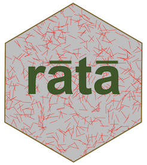

## Responses analysed together or apart

Still very much in development and not ready for use, building on 'rimu', a package for inference with multiple-response data

Two main modelling approaches

- working-independence marginal models (eg Agresti & Liu)
- working-multinomial loglinear models (eg Loughin & Scherer)

The first type are glms with a sandwich variance estimator in expanded data. 
The second type are loglinear models in expanded data, and the inference procedures 
are like Rao-Scott-type tests in survey data
